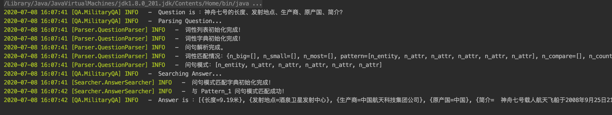

### Daily记录
- - -
#### 2020.07.07
    1. 问题
        - Java版的jieba分词无法返回词性，也无法动态添加用户词典，只有Python可以返回词性。
        - 改用Hanlp分词器。
    2. 进度
        - 完成match词典和分词词典的构建。（基本形式，后续还需完善） 
        - 引入HanLP分词器，能够自定义词典，可以分词后获取词和词性。
        - 完成问句解析器，成功从问句中提取军事实体及其词性。
        - 开始做问句模板匹配及答案搜索。
    3. 接下来的工作
        - 设计问句匹配模板，从数据库读出相应数据。      
#### 2020.07.08
    1. 问题
        - 调试不便，引入日志工具。
    2. 进度
        - 加入并配置log4j2日志工具。
        - 构建Mapper映射关系类。
        - 完成（单实体多属性）问句模式匹配模板设计，并实现相应数据库答案检索。
    3. 接下来的工作
        - 设计更多问句匹配模板。
        - 数据是最重要的，需要补充完善实体和属性的别名。

#### 2020.07.13
    1. 问题
        - JDBC开发效率低。
    2、进度
        - 加入并配置mybatis。
        - 
- - -
#### 问答效果
- 单实体多属性 \
