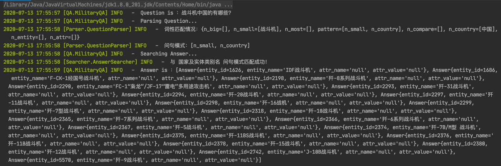
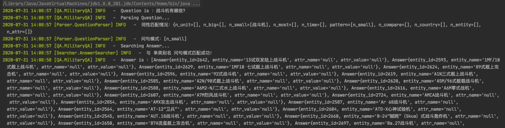
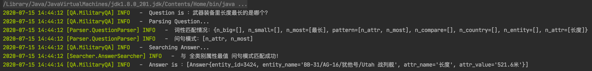
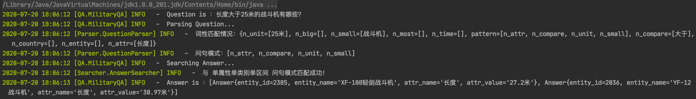
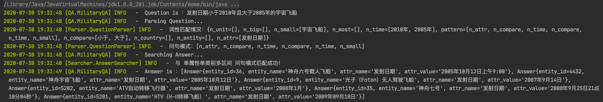
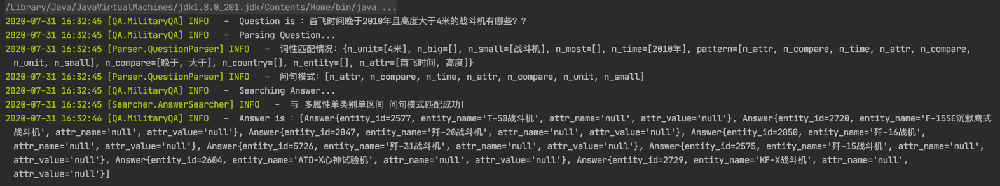

### Daily记录
- - -
#### 2020.07.07
    1. 问题
        - Java版的jieba分词无法返回词性，也无法动态添加用户词典。
        - 改用HanLP分词器。
    2. 进度
        - 完成match词典和分词词典的构建。（基本形式，后续还需完善） 
        - 引入HanLP分词器，能够自定义词典，可以分词后获取词和词性。
        - 完成问句解析器，成功从问句中提取军事实体及其词性。
        - 开始做问句模板匹配及答案搜索。
    3. 接下来的工作
        - 设计问句匹配模板，从数据库读出相应数据。      
#### 2020.07.08
    1. 问题
        - 调试不便，引入日志工具。
    2. 进度
        - 加入并配置log4j2日志工具。
        - 构建DictMapper映射关系类。
        - 完成（单实体单属性/多属性）模式。
    3. 接下来的工作
        - 设计更多问句匹配模板。
        - 数据是最重要的，需要补充完善实体和属性的别名。

#### 2020.07.13
    1. 问题
        - 属性区间值和最值类问题，需要标准化的属性值，但前期存入数据库时未将属性值标准化。
    2. 进度
        - 加入并配置Mybatis。
        - 优化加载流程。
        - 完成（国家及实体类别）模式。
        - 完成（单实体）模式。
        - 完成（多实体）模式。
        - 完成（多实体单属性/多属性）模式。
    3. 接下来的工作 
        - 将属性值标准化，并完成区间值和最值类的问题。
        - Mybatis转ES查询。
        - 补充完善实体和属性的别名。
        
#### 2020.07.14
    1. 问题 
    2. 进度
        - 将数值型和时间型的属性值做标准化处理，区分出值和单位，并进行统一换算，重新导入数据库中。
        - 完成（全类别属性最值）模式。
    3. 接下来的工作
        - 完成区间值和最值类的问题。
        - Mybatis转ES查询。
        - 补充完善实体和属性的别名。
        
#### 2020.07.15
    1. 进度
        - 修复属性最值查询存在的问题。
        - 完成（单类别属性最值）模式。
        
#### 2020.07.20
    1. 进度
        - 完成对问句中时间型和单位数值型数据的识别。
        - 完成（单属性单类别单区间）模式。

#### 2020.07.29
    1. 问题
        - 因为导入ES的数据处于多个索引中，跨索引检索导入代码逻辑比较复杂。如果一定要ES查询，最好将数据放在一张表上，再导入ES一个索引内，以便检索。否则，在数据库检索不影响性能的情况下，还是用数据库查。
        - 后续用模糊查询，可以用ES来查询相似的实体。
    2. 进度   
        - 将单轮问答修改为多轮问答。（王品）
        - 引入ES相关依赖。
        - 对ES查询进行测试。
    3. 接下来的工作
        - 完成剩余的问句模板。
        - 识别用户转热点查询的意图，提取句中的（起始时间、结束时间、实体/类别名），作为参数传给搜索部。
        - 识别用户频道跳转的意图，频道包括（头条、百科、订阅、我的收藏、浏览历史），返回对应的整数编号即可。
        - 记录各用户的ID及问句和答案，存入数据库表中。 

#### 2020.07.30
    1. 进度   
        - 完成（单属性单类别多区间）模式。
        - 修复对时间项查询存在的问题。
        
#### 2020.07.31
    1. 进度
        - 完成单轮问答信息存储（用户id，问句和答案）。
        - 规范输入接口。
        - 完成（单类别名）模式。
        - 完成（多属性单类别单区间）模式。
        
- - -
#### 问答效果示例
- 国家及实体类别名 \

- 单类别名 \

- 单实体 \

- 多实体 \

- 单实体单属性多属性 \

- 多实体单属性多属性 \

- 全类别属性最值 \

- 单类别属性最值 \

- 单属性单类别单区间 \

- 单属性单类别多区间 \

- 多属性单类别单区间 \
